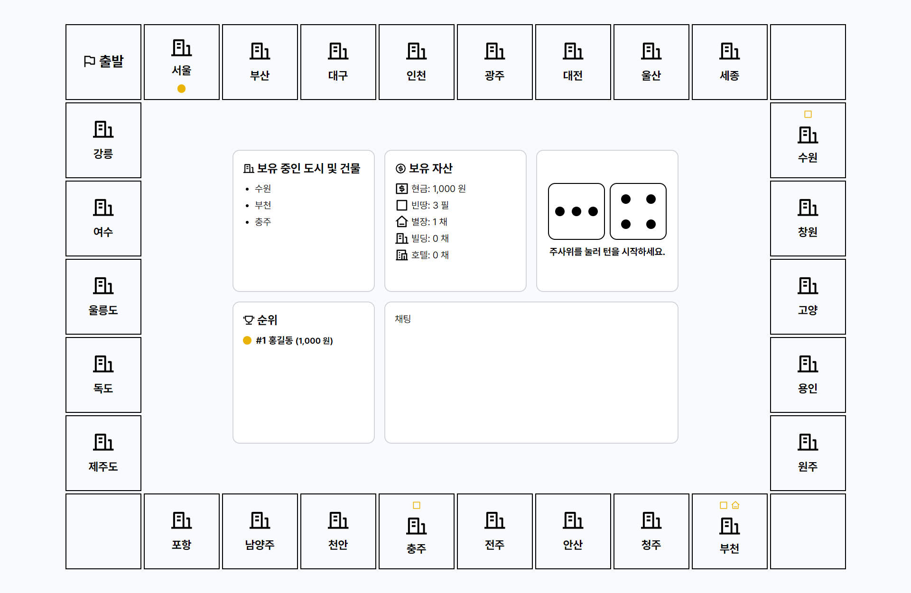

# 🎲 Marble

  [](https://www.codefactor.io/repository/github/skylightqp/marble) [](https://deepscan.io/dashboard#view=project&tid=22633&pid=25916&bid=818052)



> 웹으로 구현한 도시건설 보드게임

## 시작하기

- 의존성 설치하기

```shell
yarn
```

- 프로젝트 준비과정 실행하기

```shell
yarn prepare
```

- 개발환경 설정하기

```shell
# Generate prisma client and backend sdk.
yarn predev
```

- 데이터베이스에 스키마 적용하기

```shell
yarn db:push
```

- 개발모드로 프로젝트 시작하기

```shell
yarn dev
```

- 운영모드로 프로젝트 빌드하기

```shell
yarn build
```

## 프로젝트 구조

- apps
  - frontend
    - 프론트엔드 소스코드
  - backend
    - 게임서버, 웹서버 소스코드
- packages
  - api
    - 웹서버 API SDK
  - database
    - Prisma Schema, Client SDK
  - eslint-config-custom
    - ESLint 설정
  - tsconfig
    - tsconfig 설정

## 라이센스

[`MIT LICENSE`](LICENSE)
